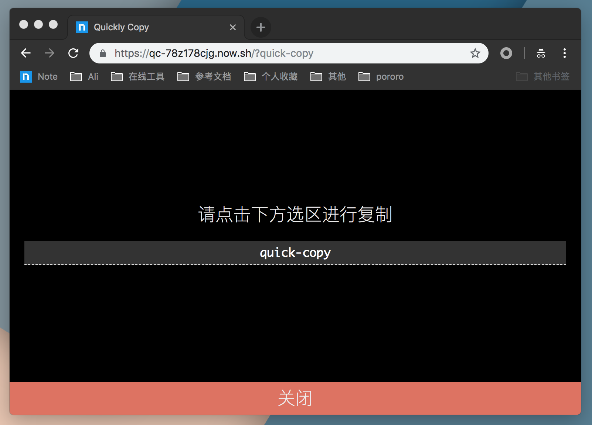

# quick-copy

根据 url search 生成可点击复制的链接

举个例子: 手机端需要复制 PC 上文字，又不能用 im 传输，这个时候就可以用这个 `quick-copy`，下面就是生成文字 `quick-copy` 的链接

[https://qc-78z178cjg.now.sh/?quick-copy](https://qc-78z178cjg.now.sh/?quick-copy)

## Usage

在 `https://qc-78z178cjg.now.sh/?` 后添加需要复制的文本即可，暂不支持回车空格

推荐添加到书签栏

## Author

ouxu([@ouxu](https://github.com/ouxu))
